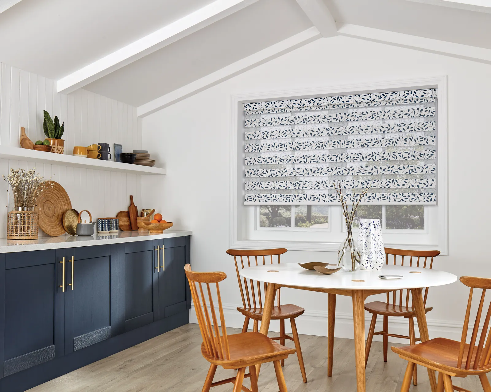
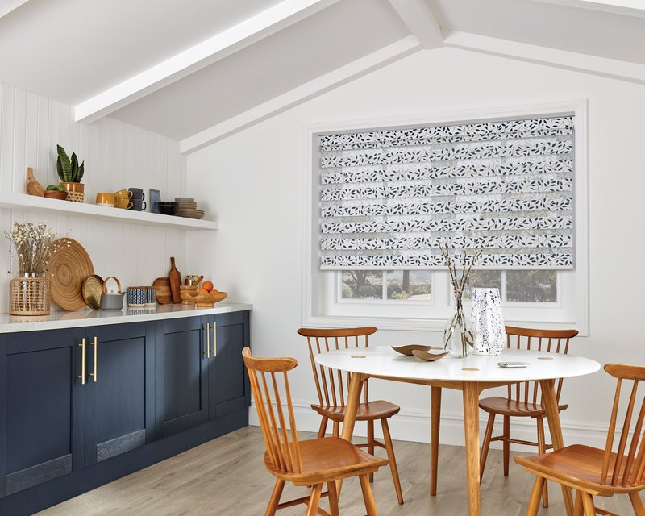

# Saddleworth Blinds - Image Usage Guide

## Overview
Your image optimization script has successfully processed **267 images** and created web-optimized versions in multiple formats and sizes. Here's how to use them effectively on your website.

## Image Formats Created

### Sizes Available
- **400px width**: Perfect for thumbnails, mobile devices, and gallery previews
- **800px width**: Ideal for service page headers, desktop gallery, and medium displays
- **1600px width**: Best for hero images, full-width banners, and high-resolution displays

### File Formats
- **JPG**: Universal compatibility, good for photos with many colors
- **WebP**: Modern format, 25-35% smaller file sizes, better quality

## Recommended Images for Your Website

### 🎯 Hero Images (Homepage)
```html
<!-- Use the largest, highest quality images for maximum impact -->

```

**Best Options:**
- `vision-blind-contemporary-1600.webp` - Modern, professional look
- `shutters-cotton-89mm-1600.webp` - Classic, luxury appeal
- `roller-blind-modern-1600.webp` - Contemporary, clean design

### 🏠 Service Page Headers (800px)
Perfect for the top of each service page:

**Roller Blinds Page:**
- `roller-blind-modern-800.webp`

**Vision Blinds Page:**
- `vision-blind-contemporary-800.webp`
- `vision-viale-linen-800.webp`
- `vision-ferrara-anthracite-800.webp`

**Shutters Page:**
- `shutters-cotton-89mm-800.webp`
- `shutters-white-classic-800.webp`

**Venetian Blinds Page:**
- `venetian-wood-natural-800.webp`

**Vertical Blinds Page:**
- `vertical-grey-800.webp`
- `vertical-blind-grey-800.webp`

**Perfect Fit Blinds Page:**
- `perfectfit-blind-white-800.webp`

**Motorised Blinds:**
- `motorised-celeste-800.webp`

### 📱 Thumbnails & Mobile (400px)
Use these for:
- Service cards on homepage
- Gallery thumbnails
- Mobile-first responsive images
- Testimonial backgrounds

### 🖼️ Gallery & Portfolio
Create image galleries using the 800px versions with 400px thumbnails.

## HTML Implementation Examples

### Responsive Images with WebP Support
```html
<picture>
  <source srcset="images/optimized/vision-blind-contemporary-800.webp" type="image/webp">
  
</picture>
```

### Service Cards (Homepage)
```html
<div class="service-card">
  <picture>
    <source srcset="images/optimized/roller-blind-modern-400.webp" type="image/webp">
    
  </picture>
  <h3>Roller Blinds</h3>
  <p>Contemporary and practical...</p>
</div>
```

### Full Responsive Hero Section
```html
<div class="hero">
  <picture>
    <source media="(min-width: 1200px)" 
            srcset="images/optimized/vision-blind-contemporary-1600.webp" 
            type="image/webp">
    <source media="(min-width: 1200px)" 
            srcset="images/optimized/vision-blind-contemporary-1600.jpg">
    <source media="(min-width: 600px)" 
            srcset="images/optimized/vision-blind-contemporary-800.webp" 
            type="image/webp">
    <source media="(min-width: 600px)" 
            srcset="images/optimized/vision-blind-contemporary-800.jpg">
    <source srcset="images/optimized/vision-blind-contemporary-400.webp" type="image/webp">
    
  </picture>
  <div class="hero-content">
    <h1>Searching for the ideal blinds?</h1>
    <p>Since 2003, we've been helping families...</p>
  </div>
</div>
```

## CSS for Lazy Loading
```css
.service-image, .hero-image {
  width: 100%;
  height: auto;
  loading: lazy; /* Native lazy loading */
  transition: opacity 0.3s ease;
}

.service-image:hover {
  opacity: 0.9;
  transform: scale(1.02);
}
```

## File Size Benefits
Your optimized images are significantly smaller:

- **Original files**: 1-15MB each
- **Optimized 1600px**: 200-600KB (70-90% smaller)
- **Optimized 800px**: 50-150KB (95%+ smaller)  
- **Optimized 400px**: 15-50KB (99%+ smaller)
- **WebP format**: Additional 25-35% size reduction

## Best Practices

### 1. Always Use Alt Text
```html

```

### 2. Specify Dimensions
```html

```

### 3. Use WebP with JPG Fallback
```html
<picture>
  <source srcset="image.webp" type="image/webp">
  
</picture>
```

### 4. Implement Lazy Loading
```html

```

## Image Categories Available

### Vision Blinds (Day/Night)
- `vision-blind-contemporary-*` (General)
- `vision-viale-linen-*` (Natural look)
- `vision-viale-mauve-*` (Colored option)
- `vision-trento-beige-*` (Neutral tone)
- `vision-setosa-pewter-*` (Modern grey)
- `vision-ferrara-anthracite-*` (Dark, dramatic)
- `vision-linoso-luna-*` (Textured finish)

### Shutters
- `shutters-cotton-89mm-*` (Premium option)
- `shutters-cotton-63mm-*` (Standard option)
- `shutters-white-classic-*` (Traditional style)

### Roller Blinds
- `roller-blind-modern-*` (Contemporary designs)

### Vertical Blinds
- `vertical-grey-*` (Classic grey)
- `vertical-blind-grey-*` (Modern grey)

### Perfect Fit
- `perfectfit-blind-white-*` (No-drill system)

### Venetian Blinds
- `venetian-wood-natural-*` (Natural wood look)

### Motorised
- `motorised-celeste-*` (Smart blind systems)

## Next Steps

1. **Replace existing images** in your HTML files with these optimized versions
2. **Update image paths** to point to `images/optimized/`
3. **Add WebP support** using `<picture>` elements
4. **Test loading speeds** - you should see significant improvements
5. **Add more images** by running the script again with new source images

## Running the Script Again

To process new images:
1. Add new photos to any of the source folders
2. Run: `python optimize_images.py`
3. New optimized versions will be created automatically

## File Naming Convention

The script creates clean, SEO-friendly names:
- `product-type-style-size.format`
- Example: `vision-viale-linen-800.webp`

This makes images easy to find and helps with SEO! 